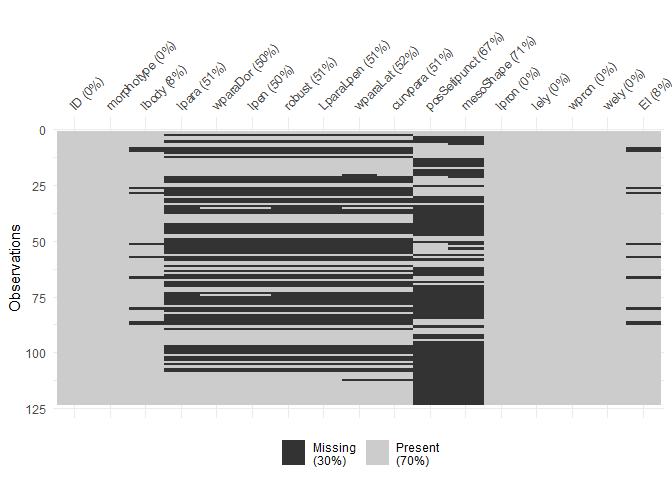
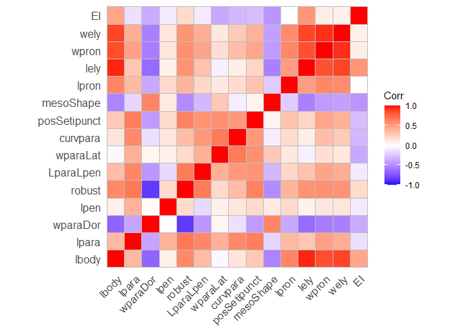
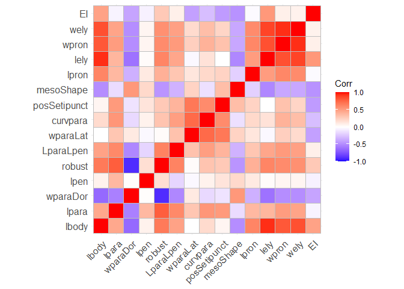

Using machine learning to predict/classify species of beetles
================

## Data

Explanation of variables in the data:

- **ID**: ID of the beetle specimen.

- **morphotype**: The species of beetle. All within the genus Hydrobius.
  This is the outcome I want to predict.

- **15 morphological features**: Includes body size, length and width of
  the wings and pronotum, and smaller structures on the males. Most
  measured in mm or μm. Some features are ratios between two lengths.
  One feature characterizing the shape of a structure (mesoShape) is an
  angle that is measured in degrees. See publication for details.

Looking at the number of samples per species.

``` r
table(beetle_data$morphotype)
```


        arcticus     fuscipes rottenbergii  subrotundus 
              22           39           27           35 

Next, looking at how much missing data there is per variable:

``` r
# Missing per variables
naniar::vis_miss(beetle_data)
```

<!-- -->

``` r
# Number of specimens with complete data
table(beetle_data[complete.cases(beetle_data), "morphotype"])
```

    morphotype
        arcticus     fuscipes rottenbergii  subrotundus 
               4            3            3            3 

As seen, there are very few complete cases, primarily do high
missingness in variables that were difficult/time-consuming to measure.
Not ideal, but can imputation to fill in likely missing values.

## Split data into train and test set

Before doing any imputation, need to split the data into train and test
data. That way data leakage will be avoided.

Want to split the data to have 60% train and 40% test data. Using
stratified splitting with species as the strata. Note that multiple
splits could be done to test the effect of the split, but not done here.
Bootstrapping methods for validation are also options later instead of
using data-split method. Since the data is highly informative, want to
also do a 25% train - 75% test set to really see if possible to get a
good model with very little data.

``` r
# set the seed for reproducibility
set.seed(200)

# Get train index: y is the outcome variable to stratify with, p is the
# proportion in test
trainIndex_60_40 <- createDataPartition(beetle_data$morphotype, p = 0.6, list = FALSE,
    times = 1)

trainIndex_25_75 <- createDataPartition(beetle_data$morphotype, p = 0.25, list = FALSE,
    times = 1)

# Split the data in 2:
beetle_train_60_40 <- beetle_data[trainIndex_60_40, ]
beetle_test_60_40 <- beetle_data[-trainIndex_60_40, ]

beetle_train_25_75 <- beetle_data[trainIndex_25_75, ]
beetle_test_25_75 <- beetle_data[-trainIndex_25_75, ]
```

Check the distribution of species per dataset.

``` r
# Train
table(beetle_train_60_40$morphotype)
```


        arcticus     fuscipes rottenbergii  subrotundus 
              14           24           17           21 

``` r
table(beetle_train_25_75$morphotype)
```


        arcticus     fuscipes rottenbergii  subrotundus 
               6           10            7            9 

``` r
# Test
table(beetle_test_60_40$morphotype)
```


        arcticus     fuscipes rottenbergii  subrotundus 
               8           15           10           14 

``` r
table(beetle_test_25_75$morphotype)
```


        arcticus     fuscipes rottenbergii  subrotundus 
              16           29           20           26 

## Imputation of missing data

In an ideal world I would want to use Multiple Imputation by Chained
Equations (MICE) to get reasonable imputed datapoints. However, due to
how the data is missing it is not possible to do this perfectly. First,
MICE assumes linear relationships and no interactions between variables
that will be imputed. We likely have both of these here, and even clear
interactions between predictors and the outcome/species (i.e. 2-way
interaction between (outcome x predictor Z) on predictor Y). Meaning
that the effect of predictor Z on predictor Y will depend on the
species. MICE treats the effect as being the same for all, i.e. no
interaction, and would severely reduce the correlations between species
and predictors. Secondly, key variables have high missing percentages.

The best option to handle the interactions, is to do the imputation
within each species. While this will give good imputations overall, it
uses information (the species identity) that would be unknown in real
new data. As such, it implies that we would need to make sure to collect
key variables for any new individual, as the validation is only valid
for individuals with low missingness. Since this is a toy example,
accept this limitation and for simplicity, only doing one imputed
dataset, although ideally you want to do several. In some cases one
variable was entirely co-linear with others and MICE didn’t impute
those. Instead the mean value of the species was used as the imputation.

To reduce data leakage, imputation was done on train data, and the train
data imputation rules were then used to impute the test data.

``` r
# Imputation with the following parameters data[,-1] to exclude the ID in the
# imputation m = 1 means that only one imputed dataset is used maxit = 25 means
# that 25 iterations were performed ignore = a vector with FALSE for train data
# and TRUE for test data. If true, data is imputed but not used to find the
# imputation rules. If false, data is used for finding the rule and is imputed.

## Combine train and test data for downstream imputation
beetle_df_combined_60_40 <- rbind(beetle_train_60_40 %>%
    mutate(data_type = "train"), beetle_test_60_40 %>%
    mutate(data_type = "test"))  #combine data into one df

beetle_df_combined_25_75 <- rbind(beetle_train_25_75 %>%
    mutate(data_type = "train"), beetle_test_25_75 %>%
    mutate(data_type = "test"))  #combine data into one df

## Arcticus
arc_df_combined_60_40 <- beetle_df_combined_60_40[, -1] %>%
    filter(morphotype == "arcticus")
imp_arc_60_40 <- mice(data = arc_df_combined_60_40, m = 1, maxit = 25, seed = 101,
    ignore = c(rep(FALSE, sum(arc_df_combined_60_40$data_type == "train")), rep(TRUE,
        sum(arc_df_combined_60_40$data_type == "test"))))  # run imputation
```

    Warning: Number of logged events: 455

``` r
arc_df_60_40 <- complete(imp_arc_60_40)  # store imputed values
sum(is.na(arc_df_60_40))  # no NAs

arc_df_combined_25_75 <- beetle_df_combined_25_75[, -1] %>%
    filter(morphotype == "arcticus")
imp_arc_25_75 <- mice(data = arc_df_combined_25_75, m = 1, maxit = 25, seed = 101,
    ignore = c(rep(FALSE, sum(arc_df_combined_25_75$data_type == "train")), rep(TRUE,
        sum(arc_df_combined_25_75$data_type == "test"))))  # run imputation
```

    Warning: Fewer than 10 rows for fitting the imputation model. Are you sure?

    Warning: Number of logged events: 556

``` r
arc_df_25_75 <- complete(imp_arc_25_75)  # store imputed values
sum(is.na(arc_df_25_75))  # no NAs


## Fuscipes
fus_df_combined_60_40 <- beetle_df_combined_60_40[, -1] %>%
    filter(morphotype == "fuscipes")
imp_fus_60_40 <- mice(data = fus_df_combined_60_40, m = 1, maxit = 25, seed = 101,
    ignore = c(rep(FALSE, sum(fus_df_combined_60_40$data_type == "train")), rep(TRUE,
        sum(fus_df_combined_60_40$data_type == "test"))))  # run imputation
```

    Warning: Number of logged events: 423

``` r
fus_df_60_40 <- complete(imp_fus_60_40)  # store imputed values
sum(is.na(fus_df_60_40))  # 26 NA in posSetipunct
fus_df_60_40$posSetipunct[is.na(fus_df_60_40$posSetipunct)] <- mean(fus_df_60_40$posSetipunct[fus_df_60_40$data_type ==
    "train"], na.rm = T)  # replace NA with mean of TRAIN data

fus_df_combined_25_75 <- beetle_df_combined_25_75[, -1] %>%
    filter(morphotype == "fuscipes")
imp_fus_25_75 <- mice(data = fus_df_combined_25_75, m = 1, maxit = 25, seed = 101,
    ignore = c(rep(FALSE, sum(fus_df_combined_25_75$data_type == "train")), rep(TRUE,
        sum(fus_df_combined_25_75$data_type == "test"))))  # run imputation
```

    Warning: Number of logged events: 505

``` r
fus_df_25_75 <- complete(imp_fus_25_75)  # store imputed values
sum(is.na(fus_df_25_75))  # 26 NA in posSetipunct
fus_df_25_75$posSetipunct[is.na(fus_df_25_75$posSetipunct)] <- mean(fus_df_25_75$posSetipunct[fus_df_25_75$data_type ==
    "train"], na.rm = T)  # replace NA with mean of TRAIN data

## Subrotundus
sub_df_combined_60_40 <- beetle_df_combined_60_40[, -1] %>%
    filter(morphotype == "subrotundus")
imp_sub_60_40 <- mice(data = sub_df_combined_60_40, m = 1, maxit = 25, seed = 101,
    ignore = c(rep(FALSE, sum(sub_df_combined_60_40$data_type == "train")), rep(TRUE,
        sum(sub_df_combined_60_40$data_type == "test"))))  # run imputation
```

    Warning: Number of logged events: 469

``` r
sub_df_60_40 <- complete(imp_sub_60_40)  # store imputed values
sum(is.na(sub_df_60_40))  # no NAs

sub_df_combined_25_75 <- beetle_df_combined_25_75[, -1] %>%
    filter(morphotype == "subrotundus")
# imp_sub_25_75 <- mice(data = sub_df_combined_25_75, m = 1, maxit = 25,
# seed=101, ignore=c(rep(FALSE, sum(sub_df_combined_25_75$data_type=='train')),
# rep(TRUE, sum(sub_df_combined_25_75$data_type=='test')))) # run imputation
# This failed due to too small N in train data. Instead, impute mean of train
# data everywhere
sub_train_means <- lapply(sub_df_combined_25_75[sub_df_combined_25_75$data_type ==
    "train", ], FUN = mean, na.rm = T)
```

    Warning in mean.default(X[[i]], ...): argument is not numeric or logical:
    returning NA

    Warning in mean.default(X[[i]], ...): argument is not numeric or logical:
    returning NA

``` r
for (i in unique(colnames(sub_df_combined_25_75))) {
    sub_df_combined_25_75[[i]][is.na(sub_df_combined_25_75[[i]])] <- sub_train_means[[i]]
}
sum(is.na(sub_df_combined_25_75))  # no NAs
sub_df_25_75 <- sub_df_combined_25_75

## Rottenbergii
rot_df_combined_60_40 <- beetle_df_combined_60_40[, -1] %>%
    filter(morphotype == "rottenbergii")
imp_rot_60_40 <- mice(data = rot_df_combined_60_40, m = 1, maxit = 25, seed = 101,
    ignore = c(rep(FALSE, sum(rot_df_combined_60_40$data_type == "train")), rep(TRUE,
        sum(rot_df_combined_60_40$data_type == "test"))))  # run imputation
```

    Warning: Number of logged events: 352

``` r
rot_df_60_40 <- complete(imp_rot_60_40)  # store imputed values
sum(is.na(rot_df_60_40))  # 19 NA in posSetipunct
rot_df_60_40$posSetipunct[is.na(rot_df_60_40$posSetipunct)] <- mean(rot_df_60_40$posSetipunct[rot_df_60_40$data_type ==
    "train"], na.rm = T)  # replace NA with mean of TRAIN data

rot_df_combined_25_75 <- beetle_df_combined_25_75[, -1] %>%
    filter(morphotype == "rottenbergii")
imp_rot_25_75 <- mice(data = rot_df_combined_25_75, m = 1, maxit = 25, seed = 101,
    ignore = c(rep(FALSE, sum(rot_df_combined_25_75$data_type == "train")), rep(TRUE,
        sum(rot_df_combined_25_75$data_type == "test"))))  # run imputation
```

    Warning: Fewer than 10 rows for fitting the imputation model. Are you sure?

    Warning: Number of logged events: 512

``` r
rot_df_25_75 <- complete(imp_rot_25_75)  # store imputed values
sum(is.na(rot_df_25_75))  # 26 NA in posSetipunct
rot_df_25_75$posSetipunct[is.na(rot_df_25_75$posSetipunct)] <- mean(rot_df_25_75$posSetipunct[rot_df_25_75$data_type ==
    "train"], na.rm = T)  # replace NA with mean of TRAIN data

# Save the complete data including the imputations as a new dataframes
beetle_data_imp_60_40 <- rbind(arc_df_60_40, rot_df_60_40, fus_df_60_40, sub_df_60_40)  #complete data 60_40 split
beetle_data_imp_25_75 <- rbind(arc_df_25_75, rot_df_25_75, fus_df_25_75, sub_df_25_75)  #complete data 25_75 split

beetle_data_train_60_40 <- beetle_data_imp_60_40 %>%
    filter(data_type == "train") %>%
    select(-c(data_type))
beetle_data_train_25_75 <- beetle_data_imp_25_75 %>%
    filter(data_type == "train") %>%
    select(-c(data_type))

beetle_data_test_60_40 <- beetle_data_imp_60_40 %>%
    filter(data_type == "test") %>%
    select(-c(data_type))
beetle_data_test_25_75 <- beetle_data_imp_25_75 %>%
    filter(data_type == "test") %>%
    select(-c(data_type))
```

## Visualize the data with PCA

Start by getting the matrix with predictors and scaling the variables.

``` r
# Obtain matrix with only numeric values, no morphotype of data_Type
beetle_matrix_60_40 <- beetle_data_imp_60_40 %>%
    select(-c(morphotype, data_type))
beetle_matrix_25_75 <- beetle_data_imp_25_75 %>%
    select(-c(morphotype, data_type))

# Scale the variables
beetle_matrix_scaled_60_40 <- beetle_matrix_60_40 %>%
    scale(.)
beetle_matrix_scaled_25_75 <- beetle_matrix_25_75 %>%
    scale(.)
```

Obtain the correlation matrix and plot this.

``` r
# Obtain correlation metrix
beetle_matrix_corr_60_40 <- cor(beetle_matrix_scaled_60_40)
beetle_matrix_corr_25_75 <- cor(beetle_matrix_scaled_25_75)

# Plot correlation
ggcorrplot(beetle_matrix_corr_60_40)
```

<!-- -->

``` r
ggcorrplot(beetle_matrix_corr_25_75)
```

<!-- -->

Next, calculate the components using the correlation matrix

``` r
# Do PCA
beetle_pca_60_40 <- princomp(beetle_matrix_scaled_60_40, cor = F)
beetle_pca_25_75 <- princomp(beetle_matrix_scaled_25_75, cor = F)

# Summary of components
summary(beetle_pca_60_40)
```

    Importance of components:
                              Comp.1    Comp.2     Comp.3     Comp.4     Comp.5
    Standard deviation     2.5491685 1.7429645 1.17755273 1.03562701 0.82587496
    Proportion of Variance 0.4367683 0.2041884 0.09319975 0.07208763 0.04584401
    Cumulative Proportion  0.4367683 0.6409567 0.73415648 0.80624411 0.85208813
                               Comp.6     Comp.7     Comp.8     Comp.9    Comp.10
    Standard deviation     0.79398107 0.69803116 0.60439262 0.48952698 0.41500606
    Proportion of Variance 0.04237155 0.03274942 0.02455231 0.01610673 0.01157612
    Cumulative Proportion  0.89445967 0.92720909 0.95176140 0.96786813 0.97944425
                             Comp.11     Comp.12     Comp.13    Comp.14
    Standard deviation     0.3879400 0.268567482 0.229002153 0.16923607
    Proportion of Variance 0.0101154 0.004847981 0.003524789 0.00192504
    Cumulative Proportion  0.9895596 0.994407626 0.997932415 0.99985746
                                Comp.15
    Standard deviation     0.0460519786
    Proportion of Variance 0.0001425445
    Cumulative Proportion  1.0000000000

``` r
summary(beetle_pca_25_75)
```

    Importance of components:
                              Comp.1    Comp.2     Comp.3     Comp.4     Comp.5
    Standard deviation     2.5328448 1.7572287 1.14780618 1.13415186 0.83776193
    Proportion of Variance 0.4311925 0.2075442 0.08855053 0.08645626 0.04717319
    Cumulative Proportion  0.4311925 0.6387367 0.72728722 0.81374348 0.86091667
                               Comp.6     Comp.7     Comp.8     Comp.9    Comp.10
    Standard deviation     0.78098378 0.67367279 0.59457160 0.44385191 0.40577794
    Proportion of Variance 0.04099568 0.03050367 0.02376087 0.01324129 0.01106702
    Cumulative Proportion  0.90191235 0.93241601 0.95617688 0.96941817 0.98048520
                               Comp.11     Comp.12     Comp.13     Comp.14
    Standard deviation     0.372321379 0.256553466 0.220735096 0.184515579
    Proportion of Variance 0.009317298 0.004423946 0.003274891 0.002288338
    Cumulative Proportion  0.989802493 0.994226439 0.997501329 0.999789667
                                Comp.15
    Standard deviation     0.0559405587
    Proportion of Variance 0.0002103331
    Cumulative Proportion  1.0000000000

``` r
# Loadings for the first 2 components
beetle_pca_60_40$loadings[, 1:2]
```

                      Comp.1      Comp.2
    lbody         0.33899569  0.21755956
    lpara         0.26533175 -0.27649837
    wparaDor     -0.30305787 -0.14398110
    lpen          0.06412485 -0.12384238
    robust        0.32990159 -0.04701433
    LparaLpen     0.25372311 -0.20541436
    wparaLat      0.09404319 -0.44508854
    curvpara      0.17484255 -0.38178486
    posSetipunct  0.23599179 -0.34167762
    mesoShape    -0.21206020 -0.28837259
    lpron         0.24441816  0.01586591
    lely          0.32435685  0.25681398
    wpron         0.34662768  0.03994501
    wely          0.33791782  0.07539477
    EI            0.07843437  0.42248387

Need 7 components to explain \>90% of the variance. First 2 components
explain 64% of the variance.

Lastly, make the PCA plot.

``` r
factoextra::fviz_pca_ind(beetle_pca_60_40,
             col.ind = beetle_data_imp_60_40$morphotype, # color by groups
             geom = "point", # only show points
             addEllipses = T, 
             ellipse.type = "norm", # make the convex hull, other options are also possible
             legend.title = "Species",
             repel = TRUE
             )
```

<!-- -->

``` r
factoextra::fviz_pca_ind(beetle_pca_25_75,
             col.ind = beetle_data_imp_25_75$morphotype, # color by groups
             geom = "point", # only show points
             addEllipses = T, 
             ellipse.type = "norm", # make the convex hull, other options are also possible
             legend.title = "Species",
             repel = TRUE
             )
```

<!-- -->

## Train and test a random forest model: 60-40 split

Start by training and evaluating the 60-40 split. Doing parameter tuning
for the number of randomly selected predictors in each split (mtry),
while keeping number of trees constant (ntree=1000). Nodesize= 1
(i.e. need at least one individual in each split). maxnode not set,
meaning the tree can grow to max size. Could also tune the number of
trees, but seems ok like this for this toy example.

``` r
# Tuning parameters: using 10-fold cross-validation with a grid search 
train_ctrl <- trainControl(method="cv", # type of resampling in this case Cross-Validated
                           number=10, # number of folds
                           search = "grid", # we are performing a "grid search" for tuning
                           )
set.seed(874)
model_rf_60_40 <- train(morphotype ~ .,
                       data = beetle_data_train_60_40,
                       method = "rf", # this will use the randomForest::randomForest function
                       metric = "Accuracy", # which metric should be optimized for 
                       trControl = train_ctrl,
                        tuneLength  = 10, # the number mtry to test, 10 different ones here
                       # options to be passed to randomForest
                       ntree = 1000,
                       nodesize=1,
                       keep.forest=TRUE,
                       importance=TRUE) 
model_rf_60_40
```

    Random Forest 

    76 samples
    15 predictors
     4 classes: 'arcticus', 'fuscipes', 'rottenbergii', 'subrotundus' 

    No pre-processing
    Resampling: Cross-Validated (10 fold) 
    Summary of sample sizes: 69, 66, 68, 69, 69, 68, ... 
    Resampling results across tuning parameters:

      mtry  Accuracy   Kappa    
       2    1.0000000  1.0000000
       3    1.0000000  1.0000000
       4    1.0000000  1.0000000
       6    0.9857143  0.9805556
       7    0.9857143  0.9805556
       9    0.9857143  0.9805556
      10    0.9857143  0.9805556
      12    0.9857143  0.9805556
      13    0.9857143  0.9805556
      15    0.9857143  0.9805556

    Accuracy was used to select the optimal model using the largest value.
    The final value used for the model was mtry = 2.

``` r
plot(model_rf_60_40)
```

<!-- -->

Using 2 randomly selected predictors (mtry=2) during tree splits gives
best accuracy.

Check variable importance next:

``` r
varImpPlot(model_rf_60_40$finalModel)
```

<!-- -->
Nothing too surprising here.

Next, how are the performance and confusion matrix for train and test
set:

``` r
# Train data
p_train <- predict(model_rf_60_40, beetle_data_train_60_40)
confusionMatrix(p_train, factor(beetle_data_train_60_40$morphotype))
```

    Confusion Matrix and Statistics

                  Reference
    Prediction     arcticus fuscipes rottenbergii subrotundus
      arcticus           14        0            0           0
      fuscipes            0       24            0           0
      rottenbergii        0        0           17           0
      subrotundus         0        0            0          21

    Overall Statistics
                                         
                   Accuracy : 1          
                     95% CI : (0.9526, 1)
        No Information Rate : 0.3158     
        P-Value [Acc > NIR] : < 2.2e-16  
                                         
                      Kappa : 1          
                                         
     Mcnemar's Test P-Value : NA         

    Statistics by Class:

                         Class: arcticus Class: fuscipes Class: rottenbergii
    Sensitivity                   1.0000          1.0000              1.0000
    Specificity                   1.0000          1.0000              1.0000
    Pos Pred Value                1.0000          1.0000              1.0000
    Neg Pred Value                1.0000          1.0000              1.0000
    Prevalence                    0.1842          0.3158              0.2237
    Detection Rate                0.1842          0.3158              0.2237
    Detection Prevalence          0.1842          0.3158              0.2237
    Balanced Accuracy             1.0000          1.0000              1.0000
                         Class: subrotundus
    Sensitivity                      1.0000
    Specificity                      1.0000
    Pos Pred Value                   1.0000
    Neg Pred Value                   1.0000
    Prevalence                       0.2763
    Detection Rate                   0.2763
    Detection Prevalence             0.2763
    Balanced Accuracy                1.0000

``` r
## 100% accurate on train data

# Test data
p_test <- predict(model_rf_60_40, beetle_data_test_60_40)
confusionMatrix(p_test, factor(beetle_data_test_60_40$morphotype))
```

    Confusion Matrix and Statistics

                  Reference
    Prediction     arcticus fuscipes rottenbergii subrotundus
      arcticus            8        0            0           0
      fuscipes            0       15            0           1
      rottenbergii        0        0           10           0
      subrotundus         0        0            0          13

    Overall Statistics
                                              
                   Accuracy : 0.9787          
                     95% CI : (0.8871, 0.9995)
        No Information Rate : 0.3191          
        P-Value [Acc > NIR] : < 2.2e-16       
                                              
                      Kappa : 0.971           
                                              
     Mcnemar's Test P-Value : NA              

    Statistics by Class:

                         Class: arcticus Class: fuscipes Class: rottenbergii
    Sensitivity                   1.0000          1.0000              1.0000
    Specificity                   1.0000          0.9688              1.0000
    Pos Pred Value                1.0000          0.9375              1.0000
    Neg Pred Value                1.0000          1.0000              1.0000
    Prevalence                    0.1702          0.3191              0.2128
    Detection Rate                0.1702          0.3191              0.2128
    Detection Prevalence          0.1702          0.3404              0.2128
    Balanced Accuracy             1.0000          0.9844              1.0000
                         Class: subrotundus
    Sensitivity                      0.9286
    Specificity                      1.0000
    Pos Pred Value                   1.0000
    Neg Pred Value                   0.9706
    Prevalence                       0.2979
    Detection Rate                   0.2766
    Detection Prevalence             0.2766
    Balanced Accuracy                0.9643

``` r
## 1 wrong subrotundus, else all correct
```

Visualize the performance/predictions

``` r
# Obtain probabilities and predicted classes
probs_60_40 <- predict(model_rf_60_40, beetle_data_test_60_40, "prob")
class_60_40 <- predict(model_rf_60_40, beetle_data_test_60_40, "raw")
TEST_scored_60_40 <- cbind(beetle_data_test_60_40, probs_60_40, class_60_40)

# plot of probabilities
p1 <- ggplot(TEST_scored_60_40, aes(x = 1:nrow(TEST_scored_60_40), y = arcticus,
    color = morphotype)) + geom_point() + labs(color = "Species", x = "index", y = "Predicted probability of arcticus")
p2 <- ggplot(TEST_scored_60_40, aes(x = 1:nrow(TEST_scored_60_40), y = rottenbergii,
    color = morphotype)) + geom_point() + labs(color = "Species", x = "index", y = "Predicted probability of rottenbergii")
p3 <- ggplot(TEST_scored_60_40, aes(x = 1:nrow(TEST_scored_60_40), y = fuscipes,
    color = morphotype)) + geom_point() + labs(color = "Species", x = "index", y = "Predicted probability of fuscipes")
p4 <- ggplot(TEST_scored_60_40, aes(x = 1:nrow(TEST_scored_60_40), y = subrotundus,
    color = morphotype)) + geom_point() + labs(color = "Species", x = "index", y = "Predicted probability of subrotundus")

ggpubr:::ggarrange(p1, p2, p3, p4, ncol = 2, nrow = 2)
```

<!-- -->

``` r
# Plot classes
ggplot(TEST_scored_60_40, aes(x = 1:nrow(TEST_scored_60_40), y = class_60_40, color = morphotype)) +
    geom_point() + labs(color = "True species", x = "index", y = "Predicted species") +
    theme_bw()
```

<!-- -->

## Train and test a random forest model: 25-75 split

Next, I will do training and evaluating the 25-75 split. Doing parameter
tuning for the number of randomly selected predictors in each split
(mtry), while keeping number of trees constant (ntree=1000). Nodesize= 1
(i.e. need at least one individual in each split). maxnode not set,
meaning the tree can grow to max size. Could also tune the number of
trees, but seems ok like this for this toy example.

``` r
# Tuning parameters: using 10-fold cross-validation with a grid search 
train_ctrl <- trainControl(method="cv", # type of resampling in this case Cross-Validated
                           number=10, # number of folds
                           search = "grid", # we are performing a "grid search" for tuning
                           )
set.seed(35)
model_rf_25_75 <- train(morphotype ~ .,
                       data = beetle_data_train_25_75,
                       method = "rf", # this will use the randomForest::randomForest function
                       metric = "Accuracy", # which metric should be optimized for 
                       trControl = train_ctrl,
                        tuneLength  = 10, # the number mtry to test, 10 different ones here
                       # options to be passed to randomForest
                       ntree = 1000,
                       nodesize=1,
                       keep.forest=TRUE,
                       importance=TRUE) 
model_rf_25_75
```

    Random Forest 

    32 samples
    15 predictors
     4 classes: 'arcticus', 'fuscipes', 'rottenbergii', 'subrotundus' 

    No pre-processing
    Resampling: Cross-Validated (10 fold) 
    Summary of sample sizes: 29, 30, 30, 28, 28, 28, ... 
    Resampling results across tuning parameters:

      mtry  Accuracy  Kappa    
       2    0.975     0.9666667
       3    0.975     0.9666667
       4    0.975     0.9666667
       6    0.975     0.9666667
       7    0.975     0.9666667
       9    0.975     0.9666667
      10    0.975     0.9666667
      12    0.975     0.9666667
      13    0.975     0.9666667
      15    0.975     0.9666667

    Accuracy was used to select the optimal model using the largest value.
    The final value used for the model was mtry = 2.

``` r
plot(model_rf_25_75)
```

<!-- -->

Using 2 randomly selected predictors (mtry=2) during tree splits gives
best accuracy.

Check variable importance next:

``` r
varImpPlot(model_rf_25_75$finalModel)
```

<!-- -->
Slightly different from the previous split, but ok.

Next, how are the performance and confusion matrix for train and test
set:

``` r
# Train data
p_train <- predict(model_rf_25_75, beetle_data_train_25_75)
confusionMatrix(p_train, factor(beetle_data_train_25_75$morphotype))
```

    Confusion Matrix and Statistics

                  Reference
    Prediction     arcticus fuscipes rottenbergii subrotundus
      arcticus            6        0            0           0
      fuscipes            0       10            0           0
      rottenbergii        0        0            7           0
      subrotundus         0        0            0           9

    Overall Statistics
                                         
                   Accuracy : 1          
                     95% CI : (0.8911, 1)
        No Information Rate : 0.3125     
        P-Value [Acc > NIR] : < 2.2e-16  
                                         
                      Kappa : 1          
                                         
     Mcnemar's Test P-Value : NA         

    Statistics by Class:

                         Class: arcticus Class: fuscipes Class: rottenbergii
    Sensitivity                   1.0000          1.0000              1.0000
    Specificity                   1.0000          1.0000              1.0000
    Pos Pred Value                1.0000          1.0000              1.0000
    Neg Pred Value                1.0000          1.0000              1.0000
    Prevalence                    0.1875          0.3125              0.2188
    Detection Rate                0.1875          0.3125              0.2188
    Detection Prevalence          0.1875          0.3125              0.2188
    Balanced Accuracy             1.0000          1.0000              1.0000
                         Class: subrotundus
    Sensitivity                      1.0000
    Specificity                      1.0000
    Pos Pred Value                   1.0000
    Neg Pred Value                   1.0000
    Prevalence                       0.2812
    Detection Rate                   0.2812
    Detection Prevalence             0.2812
    Balanced Accuracy                1.0000

``` r
## 100% accurate on train data

# Test data
p_test <- predict(model_rf_25_75, beetle_data_test_25_75)
confusionMatrix(p_test, factor(beetle_data_test_25_75$morphotype))
```

    Confusion Matrix and Statistics

                  Reference
    Prediction     arcticus fuscipes rottenbergii subrotundus
      arcticus           16        0            0           0
      fuscipes            0       28            0           0
      rottenbergii        0        0           20           0
      subrotundus         0        1            0          26

    Overall Statistics
                                              
                   Accuracy : 0.989           
                     95% CI : (0.9403, 0.9997)
        No Information Rate : 0.3187          
        P-Value [Acc > NIR] : < 2.2e-16       
                                              
                      Kappa : 0.9851          
                                              
     Mcnemar's Test P-Value : NA              

    Statistics by Class:

                         Class: arcticus Class: fuscipes Class: rottenbergii
    Sensitivity                   1.0000          0.9655              1.0000
    Specificity                   1.0000          1.0000              1.0000
    Pos Pred Value                1.0000          1.0000              1.0000
    Neg Pred Value                1.0000          0.9841              1.0000
    Prevalence                    0.1758          0.3187              0.2198
    Detection Rate                0.1758          0.3077              0.2198
    Detection Prevalence          0.1758          0.3077              0.2198
    Balanced Accuracy             1.0000          0.9828              1.0000
                         Class: subrotundus
    Sensitivity                      1.0000
    Specificity                      0.9846
    Pos Pred Value                   0.9630
    Neg Pred Value                   1.0000
    Prevalence                       0.2857
    Detection Rate                   0.2857
    Detection Prevalence             0.2967
    Balanced Accuracy                0.9923

``` r
## 3 wrong, else all correct
```

Visualize the performance/predictions

``` r
# Obtain probabilities and predicted classes
probs_25_75 <- predict(model_rf_25_75, beetle_data_test_25_75, "prob")
class_25_75 <- predict(model_rf_25_75, beetle_data_test_25_75, "raw")
TEST_scored_25_75 <- cbind(beetle_data_test_25_75, probs_25_75, class_25_75)

# plot of probabilities
p1 <- ggplot(TEST_scored_25_75, aes(x = 1:nrow(TEST_scored_25_75), y = arcticus,
    color = morphotype)) + geom_point() + labs(color = "Species", x = "index", y = "Predicted probability of arcticus")
p2 <- ggplot(TEST_scored_25_75, aes(x = 1:nrow(TEST_scored_25_75), y = rottenbergii,
    color = morphotype)) + geom_point() + labs(color = "Species", x = "index", y = "Predicted probability of rottenbergii")
p3 <- ggplot(TEST_scored_25_75, aes(x = 1:nrow(TEST_scored_25_75), y = fuscipes,
    color = morphotype)) + geom_point() + labs(color = "Species", x = "index", y = "Predicted probability of fuscipes")
p4 <- ggplot(TEST_scored_25_75, aes(x = 1:nrow(TEST_scored_25_75), y = subrotundus,
    color = morphotype)) + geom_point() + labs(color = "Species", x = "index", y = "Predicted probability of subrotundus")

ggpubr:::ggarrange(p1, p2, p3, p4, ncol = 2, nrow = 2)
```

<!-- -->

``` r
# Plot classes
ggplot(TEST_scored_25_75, aes(x = 1:nrow(TEST_scored_25_75), y = class_25_75, color = morphotype)) +
    geom_point() + labs(color = "True species", x = "index", y = "Predicted species") +
    theme_bw()
```

<!-- -->
